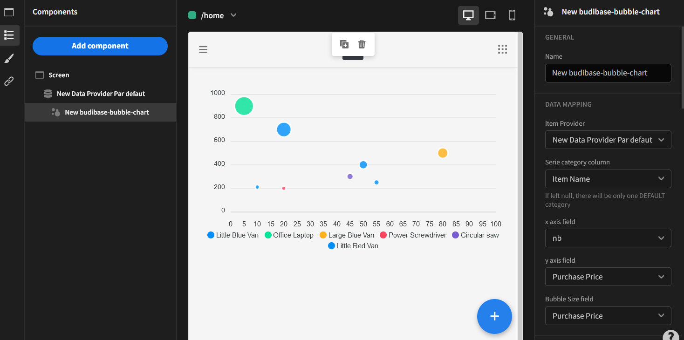

# Budibase-bubble-chart
This is a budibase component plugin. It allows to add a bubble chart to your application.
This component must be added to an existant datasource and requires several mandatory fields:
- x axis field can be a string, a numeric or options field
- y axis field which must be a numeric field
- bubbleSizeField which must be a numeric field
Have fun with this new component !



# Description
Component to display a bubble chart

Find out more about [Budibase](https://github.com/Budibase/budibase).

## Instructions
To build your new  plugin run the following in your Budibase CLI:
```
budi plugins --build
```

You can also re-build everytime you make a change to your plugin with the command:
```
budi plugins --watch
```

In the folder of the plugin
```
yarn watch 
```